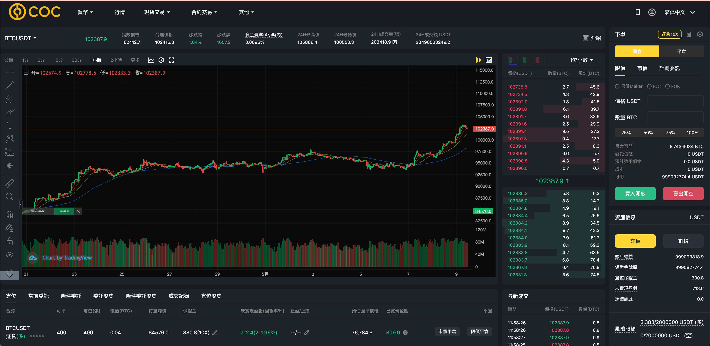
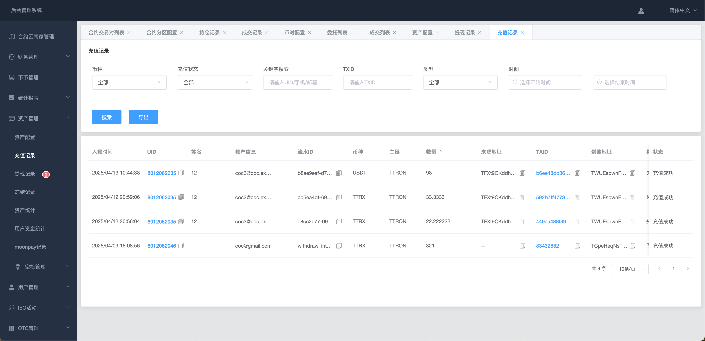
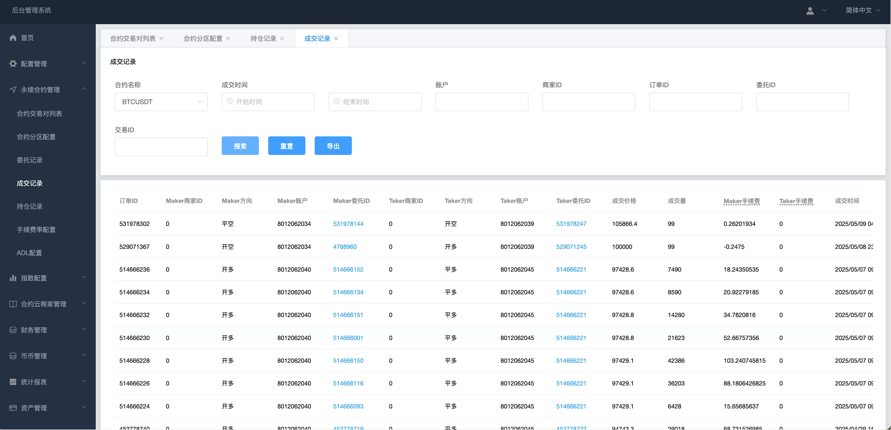
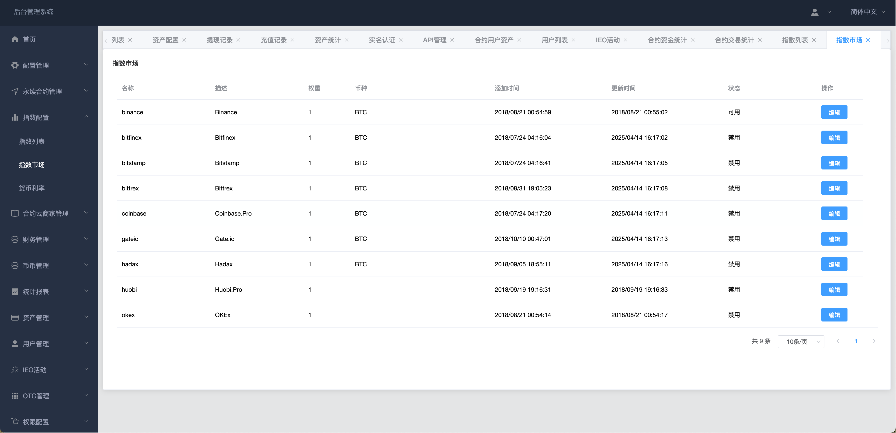
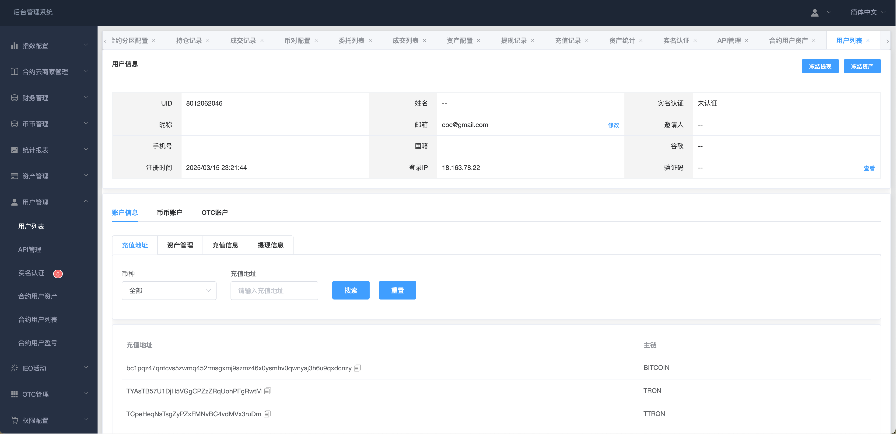

# 数字货币交易所
### BITCOIN ETHEREUM XRP SOL USDT 比特币 莱特币 数字货币交易所
-   商业化7年的数字货币交易所，完整的交易所解决方案，部署后可立即投入运营
-   现货交易，合约交易，理财，经纪人系统，充提系统，做市商系统，提供标准化的API接口
-   包含WEB，IOS，安卓，H5
-   出售全套源码，提供部署培训，代码架构培训，二开指导，技术支持
-   售价：10w USDT

## 技术栈
#### 后端：golang 微服务架构 K8S 分布式 postgres gorm redis mq
#### APP：原生IOS 安卓
#### PC端：vue

## 在线体验
#### PC端访问地址：https://www.coc.exchange
#### 账号：coc3@coc.exchange
#### 密码：1234qwer

## 商务&合作
### 邮箱：bojackworkman@gmail.com
### telegram：[@bender_cex](https://t.me/bender_cex)

## 预览
## PC端
#### 首页

#### 现货交易

#### 合约交易

#### 资产

#### 充值

## 管理后台
#### 首页

#### 充值记录

#### 合约订单成交记录

#### 合约指数管理

#### 用户信息

## IOS
#### 首页  
  

#### 现货交易  

#### 合约交易 

#### k线

#### 资产1

#### 资产2

#### 资产3

## 安卓
#### 合约交易

#### 现货交易

#### k线

#### 资产

#### 邀请返佣

