# 数字货币交易所
BITCOIN ETHEREUM XRP 数字货币交易所

### 商业化5年的数字货币交易所
### 现货交易，合约交易，理财，经纪人系统，充提系统
### 包含 IOS 安卓 PC H5 管理后台 做市商系统

## 技术栈
### 后端 golang 微服务 postgres redis mq
### 原生IOS安卓
### PC端vue

## 体验PC端
#### 访问地址：https://www.coc.exchange
#### 账号：coc3@coc.exchange
#### 密码：1234qwer

## 联系方式：bojackworkman@gmail.com

## 预览
PC端
首页
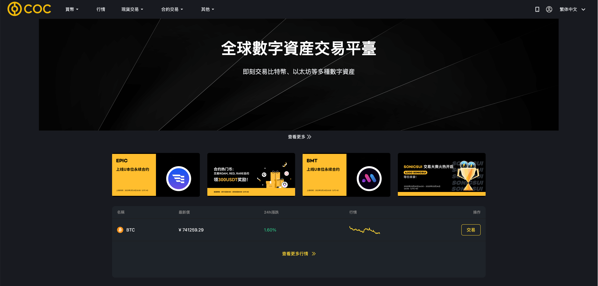
现货交易
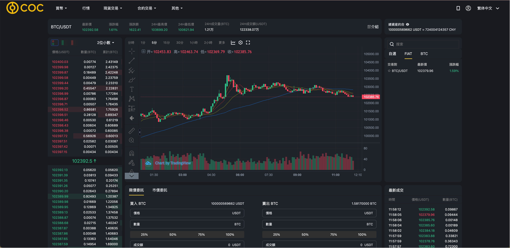
合约交易

资产
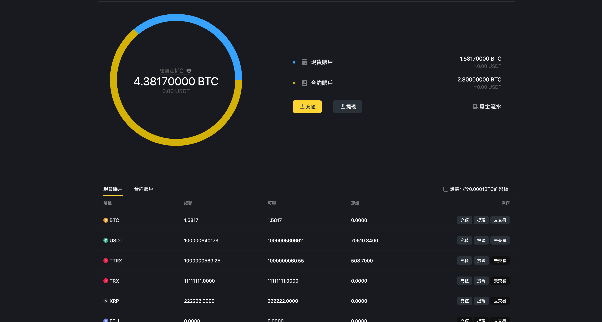
提现
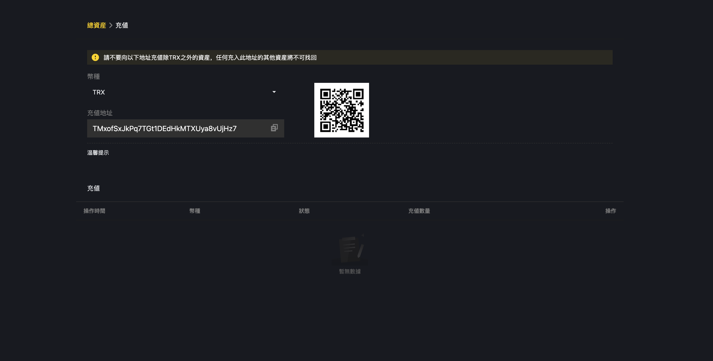
管理后台
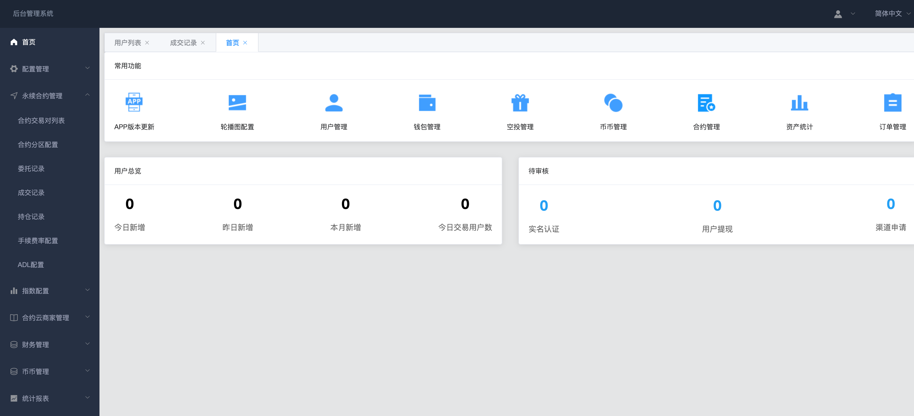

IOS
首页
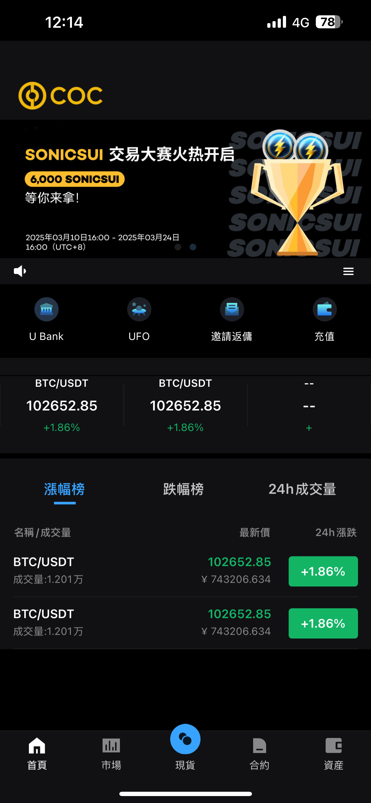
现货交易
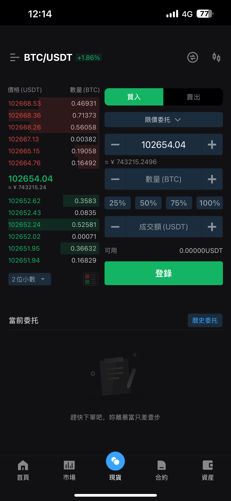
合约交易
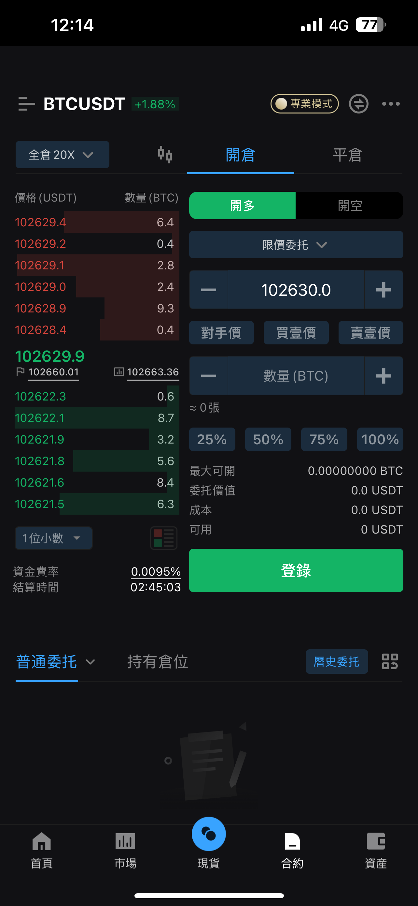
k线
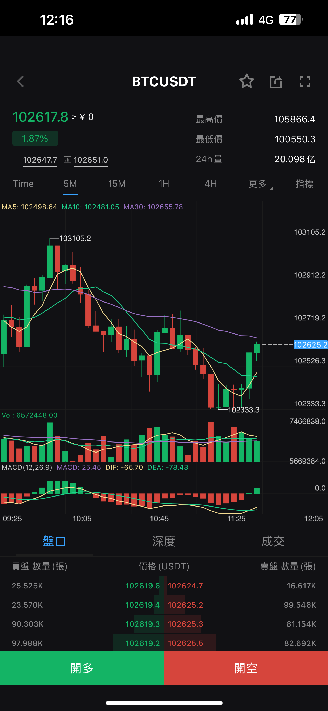
资产1
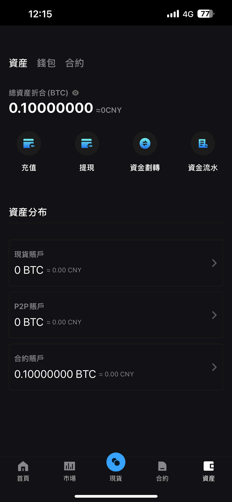
资产2
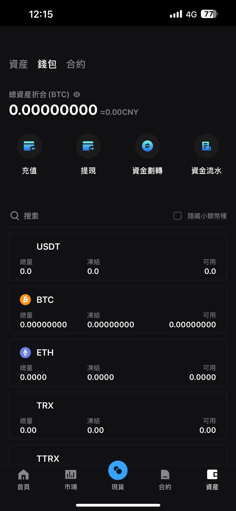
资产3
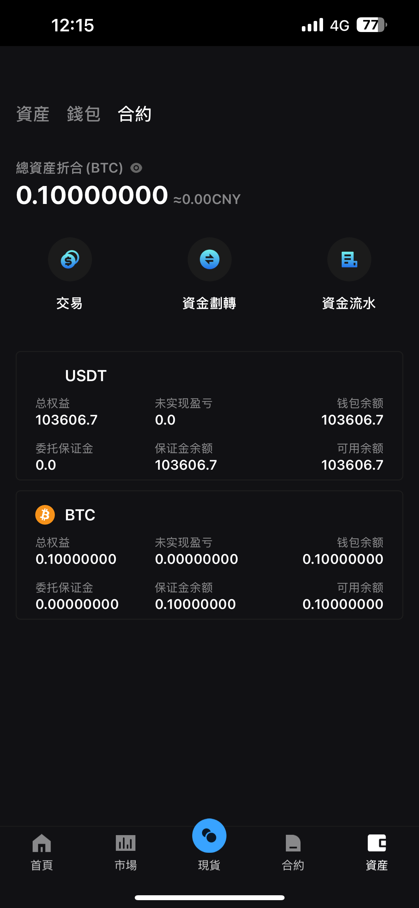
安卓
合约交易
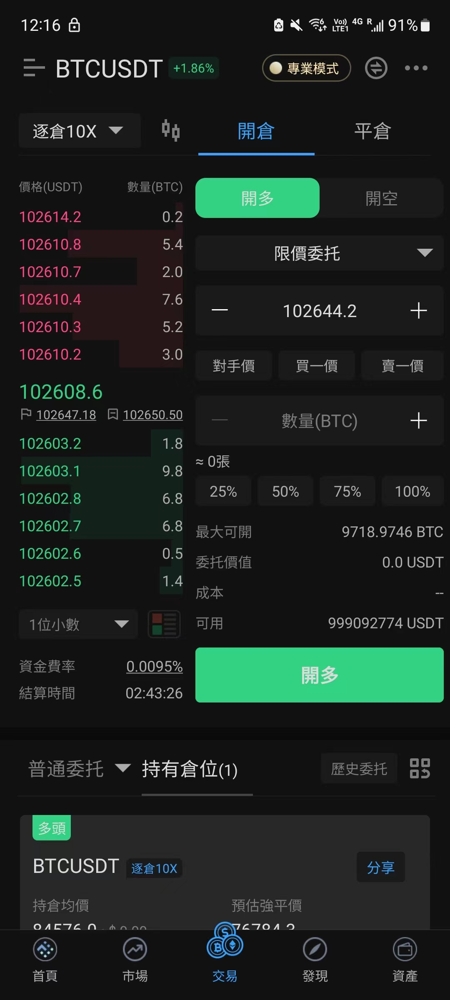
现货交易
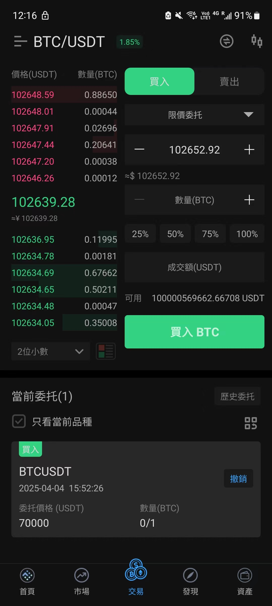
k线
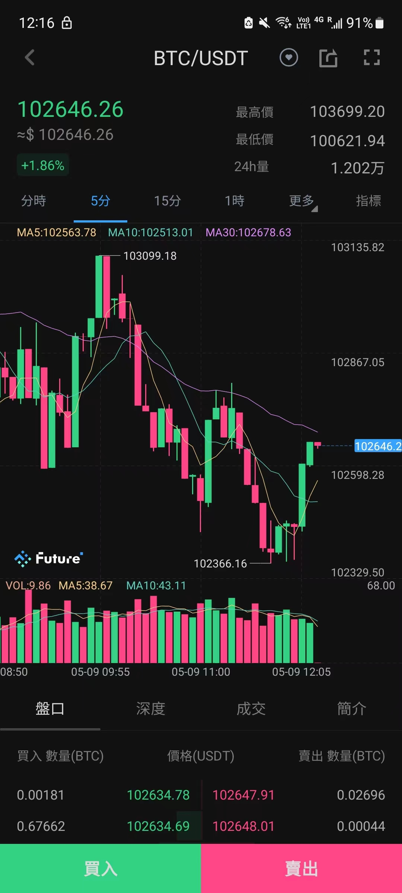
资产
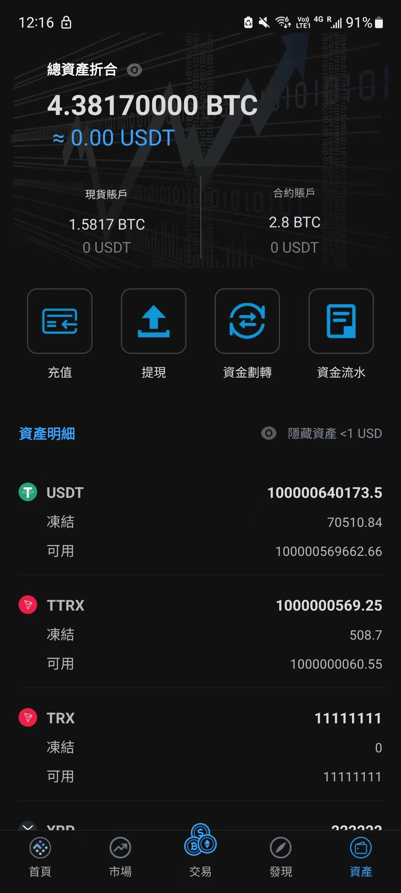
邀请返佣
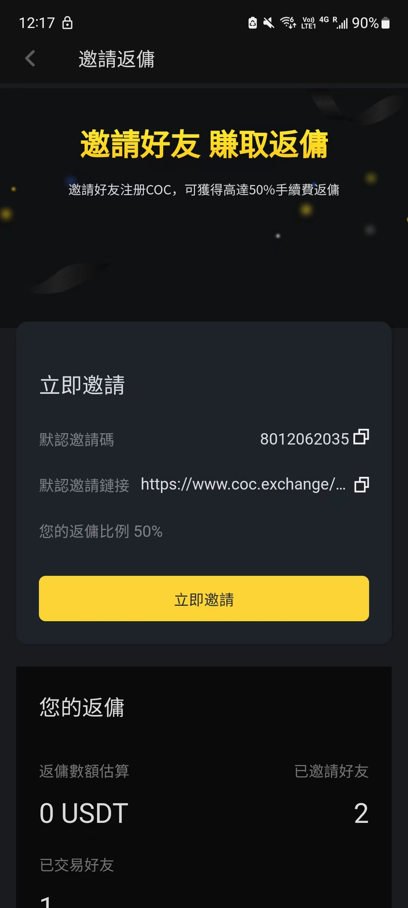
